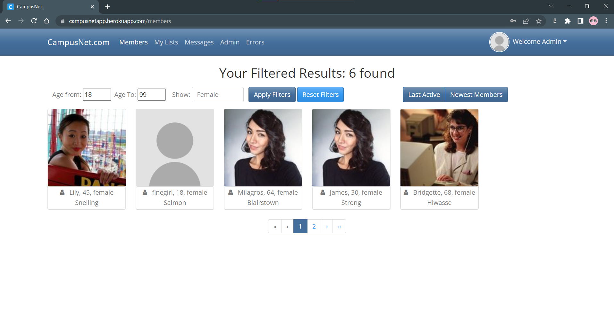

# GetConnected
> Find people who are looking for you...

Here is the link to the working website: [Campusnetapp.com](https://campusnetapp.herokuapp.com)

**Note:** Because we used free Heroku web hosting, when you try visiting this site for the first time, it might take 3-5 seconds to load but after that, it should be fine. This reason for this is that after some period of inactivity in this web app, heroku puts the app to sleep. This is just a configuration that applied to Heroku's free hosting service

# Introduction
This was a project I came up with for my CIT 380 class (Project Management). I chose this project because of the interest I had in learning about the working principles of web applications. I also had interest in learning the C# language and Microsoft .NET and Entityframework. Angular was used for the front end. While this web app may not render well in a mobile device, it still works well when you use a desktop or laptop device. The goal was to come up with an MVP project within a semester while learning about project management skills and documentation.

# Learning Goals
Here is [LINK](client/LearningGoals.txt) to the learning goals I documented as the project was in progress in case you are interested.

Here are picture rendition of the finishe MVP

Landing Page

Admin Login

Admin Panel/Tab

Member Profile

Messaging Page

Edit Profile

Error Handling Page Visible only to admins

# Technology Stack Useed
**BACK-END**

Because we used Visual Studio Code (VS Code), there are a list of extensions you will need to have:
- Angular Language Service
- Angular Snippets
- C#
- C# Extensions by JosKreativ
- HTML Boilerplate
- HTML Snippets
- Material Icon Theme
- Nuget Gallery
- Prettier - Code Formatter
- SQLite
- Bracket Pair Colorizer

**FRONT-END**

The package.json file has a list of all dependencies required for full functionalities of your front end angular application.
- Running "npm install" while in the client folder will install all those packages.

- CLI command used for creating components: Use "ng g -h" to see options

**Note:** You will need to change directory into this location "/client/src/app" before running the command:
'ng g c "name of component" --skip-tests'
I used "--skip-tests" because this project was not built using a test driven approach but that should be the best approach.

- CLI command used for creating angular services: 'ng g s "name of service" --skip-tests'

**USING NUGET GALLERY IN VS CODE**

The API.csproj file has a comprehensive list of all the packages used to achieve important functionalities in the back-end

**MAJOR REFACTORING FOR CONSTELLATION**

- appsettings.Development.json
    - DefaultConnection database name
    - TokenKey

**WANT TO IMPROVE UPON THIS PROJECT?**

- Here are a lists of functionalities that can be added to this project
   - Delete User: This feature should enable users to completely delete their account.

**DATA FLOW PIPELINE**

    WEB Server
        |
    Controller
        |
    Repository (layer of abstraction)
        |
    DbContext
        |
    Database

**LIST OF VSCODE EXTENSION**
- .Net install Tool for Extension Authos
- Angular Essentials
- Angualar Language Service
- Beautify
- Bracket Pair Colorizer
- Docker
- HTML CSS Support
- npm
- Visual Studio IntelliCode

**VsCode Settings**
- C# Extension enable import

[Back to top](#getconnected)
